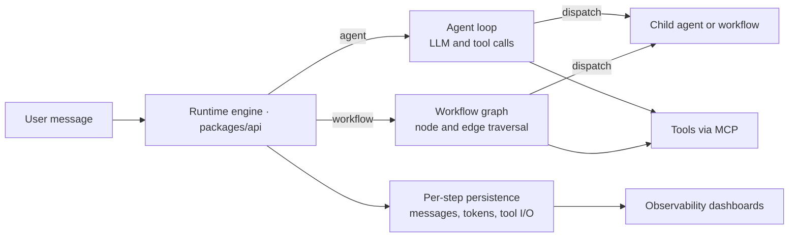
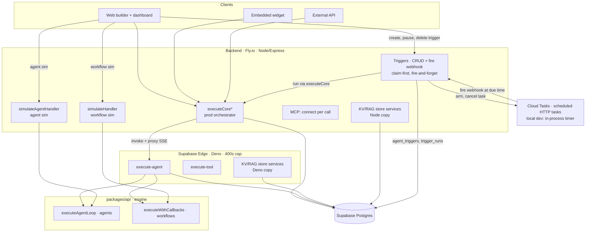
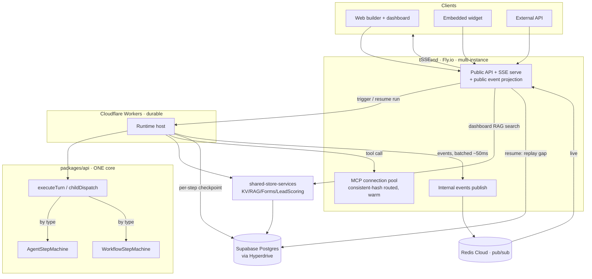
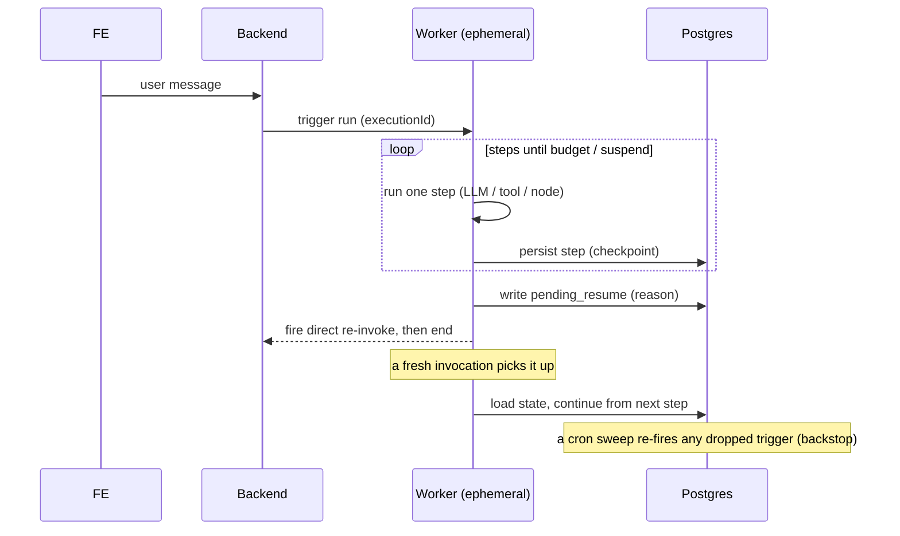
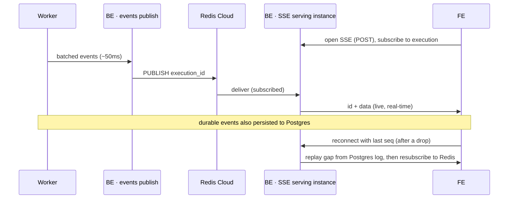

# OpenFlow

## Making it easier to build AI agents

**The platform for building agent-powered SaaS.**

Build an AI agent, connect WhatsApp, Slack, or a chatbot — and each of your customers gets their own isolated instance. Multi-tenant from day one.

---

## The Problem

Every no-code agent builder assumes **you** are the end user. The moment you try to resell an agent to your own customers, you hit a wall:

- How do I give each customer their own WhatsApp number?
- How do I isolate conversation history per tenant?
- How do I track usage and costs per customer?
- How do I manage different channels for different clients?

You end up building months of SaaS infrastructure from scratch.

## How We're Different

We don't sell to people who build agents for themselves. **We sell to people who build agents to sell to other people.**

If you're building a SaaS product powered by AI agents, this is your backend.

### Multi-Tenant I/O Layer

Connect WhatsApp, Instagram, Slack, Telegram, or a web chatbot — **per tenant**. Each of your customers gets their own isolated channels, their own conversation history, and their own data. You configure it once, we handle the routing.

### Build Any Agent in Minutes

Design agents visually with our builder. No code required. Your customers have specific needs — build a tailored agent for each one in minutes, not weeks. Vibe coding for agents: describe what you want, wire up the tools, deploy.

### Any LLM, Any Provider

Powered by OpenRouter, so you can use OpenAI, Anthropic, Google, Mistral, Meta, Cohere, or any other provider. Switch models per agent, per tenant, or per use case — no lock-in.

### Tools via MCP

Need your agent to call external APIs, query databases, or integrate with third-party services? Create or install MCP (Model Context Protocol) servers directly from the visual builder. No glue code.

### Observability Built In

Every execution is logged with full trace visibility:

- **Cost and token tracking** per execution, per tenant, per agent
- **Full message history** — see exactly what prompts were sent and what the LLM returned at each turn
- **Step-by-step trace view** — tool calls, branching decisions, latency breakdown
- **Filtering and search** across all executions
- **Session grouping** for multi-turn conversations
- **Dashboards** for usage trends, costs, and performance over time

### API-First Execution

Deploy any agent as an API endpoint. Call it from your app, your backend, your mobile client — anywhere. Your infrastructure, our agents.

### Scheduled & Event-Driven Triggers

Run agents automatically on a schedule — not just on inbound messages. Attach a **recurring** (every N minutes/hours/days/weeks/months), **one-time**, or (soon) **event-based** schedule to any agent — per tenant — give it the initial message it should receive, and it fires on its own. Scheduling is **event-driven via Google Cloud Tasks** (no polling): each occurrence is a durable task that survives backend restarts and deploys, runs the agent's published production version through the same executor as a live message, and is **safe across multiple backend instances** (at-most-once per occurrence). Pause, resume, or delete a trigger and the schedule updates instantly. Local dev runs on a zero-dependency in-process timer.

---

## Quick Comparison

|                                             | OpenFlow | Dify    | Langflow | n8n     | LangSmith |
| ------------------------------------------- | ---------- | ------- | -------- | ------- | --------- |
| Visual agent builder                        | ✅          | ✅       | ✅        | ✅       | ✅         |
| Multi-tenant isolation                      | ✅          | ❌       | ❌        | ❌       | ❌         |
| Per-tenant channels (WhatsApp, Slack, etc.) | ✅          | ❌       | ❌        | Partial | ❌         |
| Per-tenant cost tracking                    | ✅          | ❌       | ❌        | ❌       | ❌         |
| Any LLM via OpenRouter                      | ✅          | Partial | Partial  | Partial | Partial   |
| MCP tool support                            | ✅          | ❌       | ✅        | Partial | ✅         |
| API-first execution                         | ✅          | ✅       | ✅        | ✅       | ✅         |
| Built-in observability                      | ✅          | Basic   | Basic    | Basic   | ✅         |
| Open source                                 | ✅          | ✅       | ✅        | ✅       | ❌         |
| Built for SaaS resale                       | ✅          | ❌       | ❌        | ❌       | ❌         |

---

## Why You Can't Build an Agent-Powered SaaS with the Alternatives

If you're building a SaaS product where AI agents are the core of what you sell to your customers, most popular agent-building platforms are not an option — not because of technical limitations, but because their licenses explicitly forbid it.

### Dify

Dify's license states:

> "Unless explicitly authorized by Dify in writing, you may not use the Dify source code to operate a multi-tenant environment."

In Dify's terms, one tenant equals one workspace. The open-source Community Edition allows unlimited workflows within a single workspace, but the moment you need separate workspaces for separate customers — which is the definition of a SaaS — you need a paid Enterprise license with written authorization from Dify. Multi-tenant capability and custom branding are exclusive to Dify Enterprise.

This isn't a technical gap you can work around. It's a legal restriction baked into the license.

### n8n

n8n uses the Sustainable Use License, which restricts usage to internal business purposes. Specifically:

- It prohibits hosting n8n and charging customers for access.
- It prohibits selling a product or service whose value derives substantially from n8n functionality.
- It prohibits workflows that dynamically use customer credentials to connect to their own systems.

If you want to expose n8n-based functionality to your customers, you need to negotiate a separate Embed License — individual, commercial, and often costly. n8n was designed for single organizations, not for multi-tenant SaaS platforms. Their own community forums are full of founders asking whether their SaaS idea is allowed under the license. The answer is almost always no.

### Langflow

Langflow is MIT licensed, which means there are no legal restrictions on commercial or multi-tenant use. You could, in theory, build a SaaS on top of it.

However, Langflow has no built-in concept of tenants, per-customer channel routing, or per-tenant usage tracking. You would need to build the entire multi-tenant layer yourself: tenant isolation, channel management (WhatsApp, Slack, Telegram per customer), cost tracking per tenant, and customer-facing APIs. That's months of infrastructure work before you ship a single agent to a customer.

### LangSmith

LangSmith is a closed-source proprietary platform. Self-hosting requires an enterprise license. More fundamentally, LangSmith has no concept of "your customers" as end users — it's built for teams developing and monitoring their own agents, not for reselling agents to third parties.

### The Bottom Line

| Platform          | Can you legally build a SaaS with it? | What's blocking you?                                          |
| ----------------- | ------------------------------------- | ------------------------------------------------------------- |
| Dify (Community)  | No                                    | License prohibits multi-tenant use without Enterprise agreement |
| n8n (Community)   | No                                    | License restricts to internal business use only               |
| Langflow          | Yes, but...                           | No multi-tenant infrastructure — you build everything yourself |
| LangSmith         | No                                    | Closed-source, no resale model, enterprise license required   |

If you're building agents for yourself, these tools work great. If you're building agents to sell to other people, they either can't help you or will cost you months of custom engineering before you can start.

**OpenFlow is MIT licensed and multi-tenant from day one.** No license restrictions, no enterprise upsell for basic SaaS functionality, no months of plumbing before your first customer.

---

## Who Is This For

- **AI agencies** building custom agents for multiple clients
- **SaaS founders** adding AI agents as a core product feature
- **Consultancies** deploying tailored AI solutions per customer
- **Teams** that need to ship agent-powered products fast, without building multi-tenant infrastructure from scratch

---

## Tech Stack

- **Runtime:** Node.js 22+, ESM modules
- **Monorepo:** npm workspaces
- **Agent runtime:** [Vercel AI SDK](https://sdk.vercel.ai) + [OpenRouter](https://openrouter.ai)
- **Web:** Next.js 16 (App Router), React 19, TailwindCSS 4, shadcn/ui
- **Graph editor:** [@xyflow/react](https://reactflow.dev)
- **Backend:** Express 5, MCP SDK
- **Types:** Zod 4, TypeScript (strict mode)
- **Auth & DB:** Supabase
- **Deploy:** Docker, Fly.io

---

## Project Structure

```
packages/
├── api/           # State machine runtime — executes LLM graph workflows
├── backend/       # Express server with MCP support (port 4000)
├── web/           # Next.js visual graph editor (port 3101)
├── graph-types/   # Shared Zod schemas & TypeScript types
└── landing/       # Landing page
```

---

## Architecture

OpenFlow executes two kinds of things, and the distinction runs through the whole system:

- **Agents** — conversational LLM loops (LLM → tool calls → repeat, multi-turn). **Not** graph-based.
- **Workflows** — directed graphs of **nodes and edges**, traversed node-by-node.

Either can invoke the other (an agent can dispatch a workflow as a sub-task, and vice-versa), nested to a configurable depth. Both run inside `packages/api` (the engine),
 are multi-tenant, and call tools over **MCP**.

> The platform is mid-migration. The **legacy** architecture below is what runs today; the **new** architecture is the target of an in-progress *Runtime Unification* (spe
cs live in `docs/superpowers/specs/`). Both are documented here so the whole system is legible.

### Core building blocks



### Current architecture (legacy)

Today, **production agent execution runs on Supabase Edge Functions (Deno)**, invoked and SSE-proxied by the Express backend. Several things are **duplicated or divergent
** across the two runtimes, and the edge's **400-second execution cap** means a run cannot last longer than that.

Scheduled **triggers** fire agents into this same prod path on their own — **event-driven** via Google Cloud Tasks (an in-process timer in local dev), with no polling loop.



**Pain points this causes:**

- **No long runs** — the 400s edge cap kills anything slow (long chains, slow tools, human-in-the-loop pauses).
- **Duplication** — KV/RAG/store services exist twice (Node + Deno); the prod orchestrator and the simulation orchestrators are parallel implementations.
- **Divergent SSE** — three event vocabularies (prod internal, prod public, simulation) plus an internal→public adapter; three consumers each tuned to a different shape.
- **MCP reconnects every call** — no warm connection reuse.
- **The FE decides agent-vs-workflow** and calls different endpoints, instead of the backend routing by type.

### New architecture (migration target — *Runtime Unification*)

Production execution moves to **Cloudflare Workers** running a **durable, resumable step-machine**: every run is a sequence of **steps** (an agent's LLM-request / tool-ca
ll, or a workflow's node / tool-call), each one a **checkpoint persisted to Postgres**. A run spans **many** Worker invocations and can last **hours**, suspending and res
uming across them. The backend stays the public boundary and owns the MCP connection pool and SSE delivery.



**What changes:**

- **One core, two engines** — `executeTurn` drives a `StepMachine`; `AgentStepMachine` wraps the agent loop, `WorkflowStepMachine` wraps the workflow graph. The **backend
 chooses the engine by type** (the FE never does), behind one unified API for prod and one for sim.
- **Durable execution** — each step is persisted; on a budget limit / child dispatch / input wait the run **suspends** and an external trigger **resumes** it. Hours-long
runs survive Worker restarts.
- **One MCP connection pool** — backend-owned, warm, consistent-hash routed across Fly instances; tool calls reuse connections instead of reconnecting.
- **One event vocabulary** — a superset `ExecutionEvent` everywhere internally; a single curated `PublicExecutionEvent` projection at the public edge (so the widget/API s
tay a stable contract).
- **One store package** — `shared-store-services`, portable across Node + Workers (no more Node/Deno copies).

#### Durable execution — suspend & resume



#### Real-time delivery — durable two-tier SSE

The same events power **live chat streaming** (Redis pub/sub) and **resume-after-disconnect** (the Postgres log) — and survive a backend instance dying mid-run.



- **Live path** — Worker → backend → **Redis Cloud** pub/sub → the backend instance holding the SSE connection → client. Sub-second; this is the Claude-like typing feel.
- **Durable path** — completed messages, tool calls, tool results, and **token usage** are persisted to Postgres (also powering the cost dashboards). Only the raw typing-
animation deltas are live-only.
- **Failover** — if the serving backend instance dies, the Worker keeps running; the client reconnects to any instance, which replays the gap from the Postgres log. **No
durable event is lost.**

### Infrastructure summary

| Concern | Legacy | New |
| --- | --- | --- |
| Prod execution host | Supabase Edge (Deno, 400s cap) | Cloudflare Workers (durable, hours) |
| Orchestration | Duplicated (prod + 2 sim paths) | One core, two engines, BE-routed by type |
| Long-running / resume | ❌ | ✅ DB-backed suspend/resume |
| MCP connections | Per-call | BE-owned warm pool (Fly-routed) |
| Store services | Node + Deno copies | One portable `shared-store-services` |
| SSE | 3 shapes + adapter | One `ExecutionEvent` + public projection |
| Live streaming / resume | Edge stream proxied | Redis Cloud pub/sub + Postgres event log |
| DB access from compute | Direct | Postgres via Hyperdrive |
| Redis | Upstash (cache) + Redis Cloud (pub/sub) | unchanged (Upstash cache, Redis Cloud pub/sub) |

### Design notes — the non-obvious bits

A few realities that aren't obvious from the diagrams but are essential to understanding the system:

- **Agents and workflows are two different execution *engines*, not variants of one.** An agent is a conversational loop (`executeAgentLoop`); a workflow is a graph traversal over nodes and edges (`executeWithCallbacks`). Agents never run as graphs — anything graph-shaped for an agent (e.g. `buildAgentRuntimeGraph`) is a near-empty placeholder. The **backend** decides which engine to run from the entity's type; the client API is identical either way, and either engine can dispatch the other.

- **Two Redis providers, on purpose.** **Upstash** (HTTP REST) backs simple caches (GET/SET/DEL) and is Workers-friendly — but its REST interface *cannot hold a pub/sub `SUBSCRIBE`*. **Redis Cloud** (ioredis/TCP) backs everything that needs a persistent connection: pub/sub (the live SSE fan-out), distributed locks, rate limiting. That split is *why* the live event path is Redis Cloud, not Upstash.

- **The backend is multi-instance behind Fly sticky routing.** A request can land on any instance, so two things route deliberately: the **MCP connection pool** consistent-hashes each connection key to a specific instance (via Fly `fly-replay`) so a warm connection is reused, not duplicated; and the **SSE serve step** is instance-agnostic — any instance can serve a stream, because live events arrive over Redis pub/sub and resume reads from the shared Postgres log.

- **The embedded widget is a separately-deployed, external artifact.** It runs on customers' websites and carries its own copy of the public event shape — so the public SSE vocabulary (`PublicExecutionEvent`) is a **stable API contract**, not an internal detail. The runtime uses the richer internal `ExecutionEvent`; a single projection at the public edge keeps the external contract stable while internals evolve. That projection is a deliberate boundary, not an accidental adapter.

- **One persistence write, two purposes.** Persisting each step's output to Postgres is *simultaneously* the durability checkpoint (for resume) and the data behind the cost/trace dashboards — not two systems. Only the raw token-by-token typing animation is live-only (Redis); everything durable (messages, tool calls, tool results, token usage) is persisted.

- **Durable resume is DB-backed, not in-memory.** Today a parent agent dispatching a child runs *inline* (synchronously) on the backend; that can't work on a CPU-capped Worker for hours-long runs. So execution suspends to Postgres and resumes via a direct re-invoke (with a cron sweep as a backstop) — reintroducing a DB-backed resume mechanism that the inline model didn't need.

- **Scheduled triggers are event-driven, never polled.** A trigger's schedule lives as *one Cloud Tasks task per occurrence* (an in-process timer in local dev) — there is no scan loop. When a task fires it POSTs an internal, master-key-gated webhook that **claims the run first**: a single `claim_and_rearm` Postgres RPC gates `enabled`, claims via an `UNIQUE(trigger_id, scheduled_for)` idempotency key, and advances the schedule — *then* the agent runs **detached** (the webhook returns `202` immediately, so a multi-minute run isn't bound by the dispatch deadline). Because the schedule lives in Cloud Tasks + Postgres and never in a process, it's durable across restarts/deploys and **safe across multiple backend instances**: Cloud Tasks delivers each fire to one (load-balanced) instance, and the DB key guarantees at-most-once execution per occurrence regardless of which instance handles it. Long inter-occurrence gaps (monthly, far-future one-shots) beyond the scheduler's horizon are bridged by a **continuation hop** that re-arms within range. A single `TriggerScheduler` seam swaps Cloud Tasks (prod, `PRODUCTION=true`) for the in-process timer (local) with no change to the firing logic.

---

## Getting Started

### Prerequisites

- **Node.js** >= 18 (22+ recommended)
- **npm** >= 9

### Install

```bash
git clone https://github.com/your-org/openflow.git
cd openflow
npm install
```

### Environment

Create a `.env` file inside `packages/backend/` with your required credentials (Supabase, OpenRouter, etc.).

### Development

```bash
# Start both backend (port 4000) and web (port 3101) in dev mode
npm run dev

# Or run them separately
npm run dev -w packages/web       # Web only
npm run dev -w packages/backend   # Backend only
```

### Build

```bash
npm run build          # All packages
npm run build:web      # Web only
npm run build:api      # API only
```

### Checks

```bash
npm run check          # Format + lint + typecheck (all packages)
npm run lint           # ESLint
npm run format         # Prettier
npm run typecheck      # TypeScript
npm test               # Tests
```

### Docker

```bash
docker build -t openflow .
docker run -p 4000:4000 --env-file packages/backend/.env openflow
```

---

## Contributing

1. Fork the repo and create a feature branch
2. Follow the code style enforced by ESLint and Prettier (`npm run check`)
3. Never use `any` — always use explicit TypeScript types
4. Use shadcn/ui components for UI work
5. Add translations for all user-facing text
6. Open a PR against `main`

---

## License

[MIT](./LICENSE)